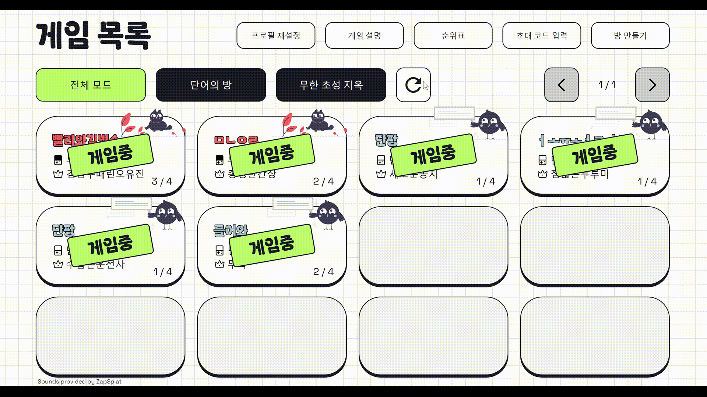
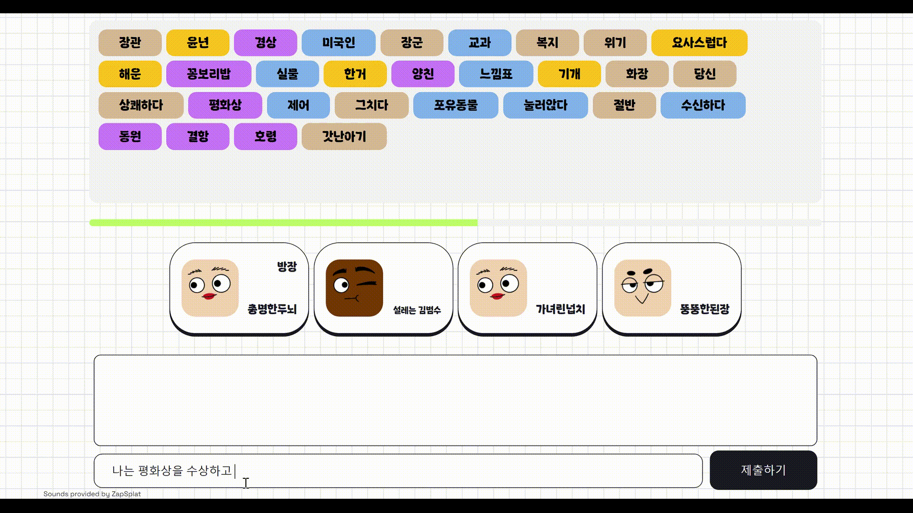

> # 어휘력 증진을 위한 사이트, <strong>단내✏</strong>
> [👉사이트 바로가기👈](https://dannae.kr)

<br>

<strong>단내</strong>는 숏폼과 줄임말들에 익숙해진 세대에게 잃어버린 어휘력을 되찾아주기 위한 어휘 학습 사이트 입니다.
어렵지 않은 게임을 통해 다양한 어휘 및 활용 방법에 대해 학습할 수 있습니다.

## 주요 기능
1. 단어들을 활용하여 문장을 작성하는 게임인 <strong>'단어의 방'</strong>
2. 초성에 맞는 단어를 입력하는 게임인 <strong>'무한 초성 지옥'</strong>
3. 경쟁심 자극을 위한 랭킹 시스템

## 게임별 규칙
### [단어의 방]

1. 제시된 단어를 최대한 많이 활용하여 제한시간 20초 내에 문장을 입력한다.

2. 주어진 단어들의 난이도와 사용한 단어의 갯수에 비례해서 점수를 얻는다.

3. 만약
```
    - 문장이 아님
    - 완결된 문장이 아님
    - 단어의 의미와 문법에 맞지 않게 문장에서 사용
    - 제한시간 초과
```
 위 4가지 경우에 해당할 경우 점수를 얻을 수 없다. 

4. 매 라운드별로 모든 플레이어가 사용한 단어는 사용완료 처리되며, 해당 단어들은 다음 라운드부터는 점수를 얻을 수 없다.

5. 게임에 참여한 모든 플레이어가 제시된 단어를 모두 사용했거나 하나도 사용하지 못했을 경우 게임은 종료된다.

### [무한 초성 지옥]
1. 제시된 초성에 맞는 단어를 입력한다.

2. 입력된 단어의 난이도에 비례해서 점수를 얻는다.

3. 만약 
```
    - 이미 사용된 단어
    - 표준대국어사전에 없는 단어
    - 초성에 맞지 않는 단어
    - 제한시간 초과
```
위 4가지 경우에 해당할 경우 점수를 얻을 수 없다.

4. 매 턴마다 플레이어가 입력한 단어는 난이도에 따라 다르게 색상처리되어 화면에 표시되며, 틀렸을 경우에는 빨간색으로 나타난다.

    플레이어가 탈락할 때마다 생존한 플레이어들은 추가 점수를 획득한다.

5. 다인원이 참여했을 경우 최종 1인이 선정될 경우, 혼자 참여했을 경우 오답을 입력했을 경우에 게임이 종료된다.

## 사용 예시
### 1. 플레이어 생성


닉네임과 프로필 이미지를 고를 수 있다.

이때 닉네임을 따로 설정하지 않아도 랜덤 닉네임이 부여되고, 이를 수정할 수 있다.

모두 선택 후 접속하면 공개된 방 리스트가 조회되는 메인페이지로 이동한다.

### 1-1. 프로필 재설정


닉네임과 프로필 이미지는 상단의 프로필 재설정 버튼을 통해 바꿀 수 있다.


### 2. 방 생성


공개/비공개 설정과 게임 모드 선택, 이름을 작성하여 방을 생성할 수 있다.

이때 방을 생성한 사람이 초기 방장으로 설정된다.

### 3. 방 접속



메인 화면으로 들어가게 될 경우, 공개된 모든 방들이 조회되며, 해당 방들이 현재 플레이중인지 아닌지 알 수 있다.

플레이어는 플레이중이 아닌 공개방을 선택해 들어갈 수 있으며, 게임 모드별로 어떤 방들이 있는지 조회할 수 있다.


공개된 방일 경우, 리스트에서 선택해서 들어갈 수 있다. 


비공개 방일 경우 메인 화면의 우측 상단에 있는 `초대 코드 입력`을 통해 비공개 방에 접속할 수 있다.

이때 입력하는 코드는 방의 우측 상단에 적혀있는 6자리 숫자이다.

### 4. 게임 시작


방장을 포함하여 최대 4명까지 방에 입장할 수 있다.

방에 입장한 모든 플레이어들이 준비했을 경우 `준비하기` 버튼이 `시작하기`로 바뀌며, 이를 누르면 게임을 시작할 수 있다.

### 5. 단어의 방
#### 1) 단어 제시


단어의 방을 시작하게 되면 처음에 단어 30개가 주어지며, 다양한 난이도의 어휘가 화면에 제시된다.

#### 2) 문장 입력 및 채점


`n라운드가 시작되었습니다!`라는 문구가 화면에 나타나면 20초의 제한시간 내로 주어진 단어를 최대한 활용하여 완성된 문장을 입력한다.

현재 라운드에 참여한 모든 플레이어가 정답을 제출했거나 제한 시간이 지났을 경우 입력한 문장을 채점한 결과가 출력된다.

그리고 문장이 맞았을 경우 각 플레이어들이 입력한 문장이 나타나며, 틀렸을 경우 '문장을 완성하지 못했습니다.' 라는 문장이 플레이어의 위쪽 말풍선으로 나타난다,

또한 맞춘 사람의 경우에는 몇점을 얻었는지 플레이어 카드 위에 해당 라운드에서 얻은 점수가 표시된다.

### 6. 무한 초성 지옥
#### 1) 초성 제시


무한 초성 지옥을 시작하게 되면 처음에 초성이 제시되며, 해당 초성은 5초간 화면에 보여준 뒤 사라지게 된다. 

이후 플레이어들마다 돌아가면서 초성에 맞는 단어를 입력하게 된다.

#### 2) 문장 입력 및 채점


본인의 턴이 되었을 경우, 10초의 제한시간과 함께 알림 문구가 전달되며, 이를 보고 플레이어는 단어를 입력하게 된다.

타인의 턴일 경우, 누구의 턴인지 해당 플레이어의 카드가 녹색이 되며, 채팅창에 누구의 턴인지 알려주는 알림 문구가 오게 된다.

초성에 맞는 올바른 단어를 입력했을 경우 해당 플레이어가 입력한 단어는 난이도별로 다른 색상을 띄며 화면에 나타나게 된다. 


옳지 않은 단어(이미 사용된 단어, 존재하지 않는 단어, 초성에 맞지 않는 단어, 제한시간 초과)를 입력했을 경우 빨간색으로 입력했던 단어가 올라가게 되며, 틀린 이유를 정답 입력창에 띄워준다.

또한 플레이어별 해당 턴에서 얻은 점수 또는 탈락 여부는 플레이어 카드 위에 표시된다.


### 7. 단어 뜻 조회


`단어의 방`에서는 제시된 단어들 위에, `무한 초성 지옥`에서는 입력된 단어들 위에 마우스를 올려둘 경우 각 단어들의 뜻을 조회할 수 있다.

단어의 뜻이 여러개일 경우, 스크롤을 내려가며 단어의 뜻을 확인할 수 있다.

### 8. 결과 조회


게임이 종료되면 각 플레이어가 얻은 총점과 등수를 포함한 결과창을 띄워준다.

그리고 돌아가기를 누르면 대기실로 복귀하게 된다.

### 9. 게임별 순위 조회


게임별로 현재 상위 5등이 누구인지 확인할 수 있다.

### 10. 게임 방법 조회


게임 모드별로 어떻게 게임이 진행되는지 게임 설명을 통해 알 수 있다.


추가적으로 방에 들어가서도 어떤 게임인지 상세 설명을 조회할 수 있다.

## 참여 인원 및 역할
💗TEAM Dannae💗

