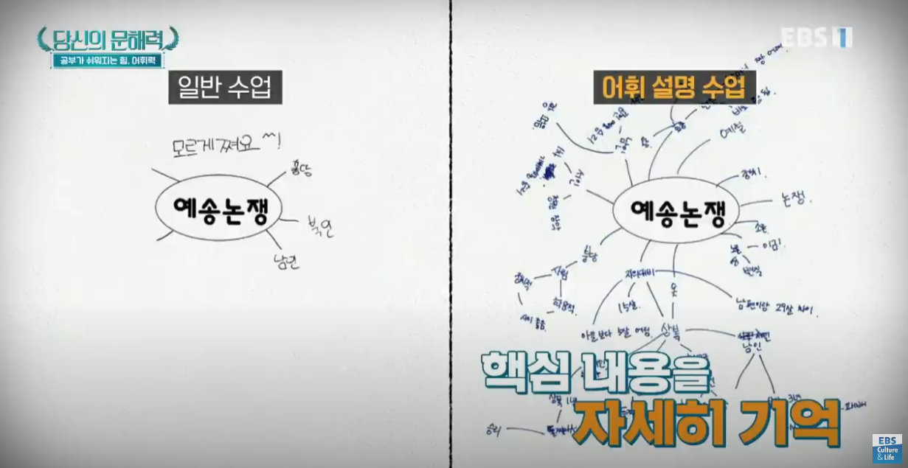
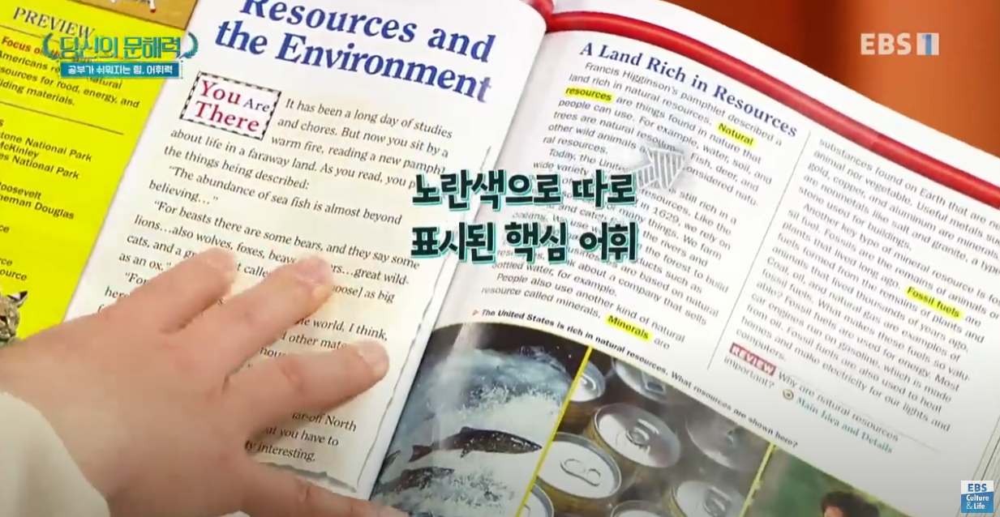
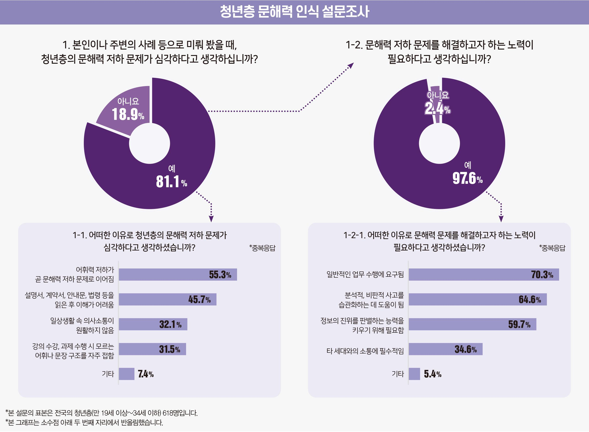
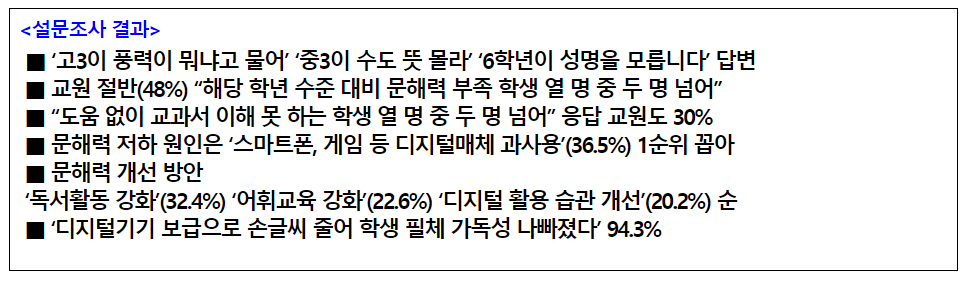

# 요구사항 정의서

## 프로젝트 정보

- 프로젝트명: 치어나다 (똑똑하고 뛰어나다)
- 프로젝트 기간: 2024년 10월 14일 ~ 2024년 11월 19일
- 프로젝트 구성원: 김범수, 강성구, 김일태, 오유진, 정상영, 황예빈

## 요구사항 목록

# 크롬 익스텐션

1. 글을 읽다가 모르는 단어위에 마우스를 가져간다.
   1. 단어 검색 기록을 저장한다.
2. 단어에 하이라이트가 되고, 단어의 뜻을 띄워준다.
   1. 단어의 뜻
   2. 영어로 변환한 단어
   3. 제공되지 않는 단어를 조회할 경우 백과사전에 등록된 정보 제공s

추가사항

- UI 커스텀 기능

참고 익스텐션

- https://chromewebstore.google.com/detail/네이버-영어사전-naver-english-di/jfibpeiddefellcfgnijpcpddoimbdij
- https://informationpark1.tistory.com/entry/자동-번역-크롬-확장-프로그램-마우스-커서만-올리면-되는-사전-Cool-Tooltip-Dictionary-설치방법사용방법#google_vignette

# 단어 웹사이트

1. 단어 퀴즈
2. 언어 이해 퀴즈
   1. 기사를 기반으로 생성형 AI를 이용해 퀴즈를 만든다.
   2. 퀴즈를 바탕으로 점수를 매기고 순위를 매기고 랭킹을 등록할 수 있다.(비로그인)
3. 많이 찾아본 단어 랭킹
4. 최근에 찾아본 단어

[요구사항 정의서](https://www.notion.so/1260cfca537f8016ae0de531ed86d373?pvs=21)

# 요구사항 리스트

| 구분     | 요구사항 ID           | 기능명                | 기능 상세 설명                                                                        | 우선 순위 |
| -------- | --------------------- | --------------------- | ------------------------------------------------------------------------------------- | --------- |
| 익스텐션 | WordInfo_001          | 단어 설명 제공        | 단어에 마우스를 올리면 국어사전 뜻을 보여줍니다.                                      | 0순위     |
| 익스텐션 | WordInfo_002          | 단어 정보 제공        | 국어사전에 존재하지 않는 단어는 백과사전의 설명을 보여줍니다.                         | 0순위     |
| 익스텐션 | ServiceNavigation_001 | 우리 서비스 이동      | 누적된 단어 정보 또는 퀴즈를 위한 서비스 페이지로 이동합니다.                         | 1순위     |
| 익스텐션 | UICustom_001          | UI 커스터마이징       | 설명 박스 색상, 폰트 사이즈                                                           | 2순위     |
| WEB      | Statistics_001        | 최다 조회 단어 리스트 | (일정 기간동안) 가장 많이 조회된 단어                                                 | 2순위     |
| WEB      | Statistics_002        | 최근 조회 단어 리스트 | ---                                                                                   | 0순위     |
| WEB      | Quiz_001              | 어휘력 퀴즈           | 조회된 단어와 그 단어가 사용된 문장, 문단을 기반으로 적절한 단어를 판단하는 퀴즈 생성 | 0순위     |
| WEB      | Quiz_002              | 문해력 퀴즈           | 조회된 단어와 그 단어가 사용된 문장, 문단을 기반으로 문해력에 대한 퀴즈 생성          | 0순위     |
| WEB      | Ranking_001           | 퀴즈 순위 제공        | 퀴즈에 대한 정답률, 풀이 시간에 따른 랭킹 제공                                        | 1순위     |

# API 모음

- https://krdict.korean.go.kr/openApi/openApiInfo
- https://stdict.korean.go.kr/openapi/openApiInfo.do

# 사용성 분석

1. 어휘력이 문해력에 끼치는 영향

https://www.youtube.com/watch?v=xQ5RFh-HuIc&t=139s

- 문해력이 부족한(단어의 뜻을 많이 모르는) 상황에서는 학업에 대한 동기 부여도 떨어지며 능률도 저하된다.
- 미국의 교과서의 경우 핵심 단어에 대한 모든 정보를 제공하고 시작하며 이러한 느낌의 접근이 우리가 생각하는 익스텐션과 비슷하다.
- 문장에 하이라이트된 단어처럼 웹에서 단어에 마우스를 올려 정보를 제공해주면 문장을 읽어나가는 데에 있어 흐름이 끊기지 않는다.
- 단순히 의미를 제공해주는 데에 있어서 그치지 않고 이를 활용한 서비스를 만들어 어휘력 향상에 2차적인 가이드 제공

2. 청년층 문해력 인식 설문조사

https://www.hansungnews.com/article/view/1537

- 안미애(경북대학교 국어국문학과) 교수는 “글이 집이라면, 어휘는 집을 이루는 벽돌”이라며 “어휘력 저하가 문해력 저하로 이어지는 것이 사실”이라고 설명했다.

- 윤석진(충남대학교 국어국문학과) 교수는 “대학에서 글쓰기 교양 수업이 진행된다는 사실은 공교육 과정에서 본질에 맞지 않는 언어교육이 이뤄졌다는 증거”라며 “지속적으로 언어교육을 받았음에도 생각을 표현하는 데에 문제가 있다면 기존의 언어교육을 되짚어야 한다”고 말했다.

3. 2024년 학생 문해력 실태 인식 설문조사 결과

https://www.kfta.or.kr/usr/wap/detail.do?app=16527&seq=270000370496

- ‘학생들의 문해력이 과거에 비해 어떻냐’는 질문에 ‘저하됐다’(저하 53%, 매우 저하 39%)는 답변이 91.8%에 달했다. 좀 더 구체적으로는, 해당 학년 수준 대비 문해력이 부족한 학생이 ‘21% 이상’이라고 답한 교원이 절반 가까운 48.2%에 달했다. ‘31% 이상’이라는 답변만도 19.5%였다. 또한 글의 맥락과 의미를 잘 이해하지 못하는 학생이 ‘21% 이상’이라고 답한 교원도 46.6%나 됐다. 어려운 단어나 한자어를 이해하지 못하는 학생이 ‘21% 이상’이라는 답변은 무려 67.1%였다.

# 요구사항 정의서 수정

| 구분     | 요구사항 ID           | 기능명               | 기능 상세 설명                                                                                                                                                                          | 우선 순위 |
| -------- | --------------------- | -------------------- | --------------------------------------------------------------------------------------------------------------------------------------------------------------------------------------- | --------- |
| WEB      | Signup_001            | 학생 회원가입        | 학교, 학년, 반, 번호, 이름, 전화번호, 비밀번호를 입력하여 회원가입을 할 수 있습니다.                                                                                                    | 0순위     |
| WEB      | Signup_002            | 교사 회원가입        | 학교, 학년, 담당 반, 이름, 전화번호, 교수자용 이메일, 비밀번호를 입력하여 회원가입을 할 수 있습니다.                                                                                    | 1순위     |
| WEB      | Login_001             | 유저 로그인          | 이메일과 비밀번호를 입력하여 로그인 할 수 있습니다.                                                                                                                                     | 0순위     |
| WEB,학생 | Textbook_001          | 교과서 목록 불러오기 | 학생과 교사는 로그인하여 자신의 교과서 목록을 불러올 수 있습니다.                                                                                                                       | 2순위     |
| WEB,학생 | Textbook_002          | 교과서 선택          | 학생과 교사는 교과서 목록 중 교과서를 선택하면 해당 교과서를 열 수 있습니다.                                                                                                            | 2순위     |
| WEB,학생 | Textbook_003          | 교과서 보기          | 학생과 교사는 교과서를 볼 수 있습니다.                                                                                                                                                  | 0순위     |
| WEB,교사 | Textbook_004          | 교과서 등록          | 교사는 교과서 PDF를 등록하여 교과서 목록에 추가할 수 있습니다.                                                                                                                          | 2순위     |
| WEB      | WordInfo_001          | 핵심 단어 표시       | 교과서에는 핵심 단어로 판단된 단어들이 하이라이팅되어 보여집니다.                                                                                                                       | 1순위     |
| WEB      | WordInfo_002          | 단어 정보 제공       | 교과서에 있는 핵심 단어의 뜻은 측면 단어장에 제공됩니다.                                                                                                                                | 0순위     |
| WEB      | ServiceNavigation_001 | 교과서 보기 이동     | 상단 네비게이션 바를 통해 교과서를 보는 페이지로 이동할 수 있습니다.                                                                                                                    | 0순위     |
| WEB,학생 | ServiceNavigation_002 | 문제 풀기 이동       | 상단 네비게이션 바를 통해 학생은 문제를 푸는 페이지로 이동할 수 있습니다.                                                                                                               | 0순위     |
| WEB,학생 | ServiceNavigation_003 | 내 단어장 이동       | 상단 네비게이션 바를 통해 학생은 나의 단어장 페이지로 이동할 수 있습니다.                                                                                                               | 1순위     |
| WEB,교사 | ServiceNavigation_004 | 내 반 이동           | 상단 네비게이션 바를 통해 교사는 내 반 인원의 문제 풀이 현황을 확인할 수 있습니다.                                                                                                      | 2순위     |
| WEB,학생 | WordTest_001          | 빈 칸 문제 풀기      | 학생은 지문에 올바른 단어 적용을 선택하는 문제를 풀게됩니다. 문제는 한 문제씩 풀고 넘어가며 마지막엔 풀이 결과를 확인할 수 있습니다. 틀린 문제는 내 단어장에 저장됩니다.                | 0순위     |
| WEB,학생 | WordTest_002          | 자음 문제 풀기       | 학생은 단어에 대한 자음과 뜻을 바탕으로 그 단어를 맞추는 문제를 풀게됩니다. 문제는 한 문제씩 풀고 넘어가며 마지막엔 풀이 결과를 확인할 수 있습니다. 틀린 문제는 내 단어장에 저장됩니다. | 0순위     |
| WEB,교사 | TestResult_001        | 테스트 결과 확인     | 교사는 내 반 이동을 통해 자기 반의 학생들의 풀이 현황을 확인할 수 있습니다.                                                                                                             | 2순위     |
| WEB,학생 | MyWord_001            | 내 단어장 확인       | 학생은 내 단어장에 저장된 단어와 그 뜻, 용례 지문등을 확인할 수 있으며 하루가 지나야 내 단어장에서 삭제할 수 있습니다.                                                                  | 2순위     |
| Alarm    | TestAlarm_001         | 문제 풀제 알림       | 문제가 출제되면 학생들에게 푸시 알림이 전달됩니다.                                                                                                                                      | 3순위     |
